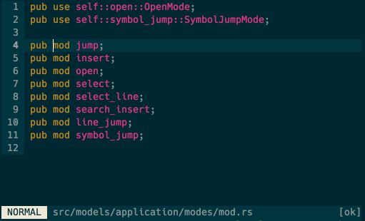

# Usage

`amp [file1 file2 ...]`

## Exiting

Before launching Amp, it's always a good idea to know how to quit. Type `Q`
to quit from normal mode. Please note, Amp **will** close modified buffers
without warning. Given that, it's recommended to close buffers beforehand using
`q` (which _will_ prompt before closing modified buffers) until the workspace is
empty.

## Opening Files

Unless you've specified file paths when running Amp, you'll be greeted with a splash screen. You can find and edit files in open mode, by hitting `Space`.

### Searching for Files

Amp's file finder is a little different than most. Rather than using a string fuzzing algorithm to match file paths against the query, it uses string fragments. Instead of typing full words, use fragments of the path name, separated by spaces:

`mod app op` --> src/__mod__els/__app__lications/__mod__es/__op__en.rs

Search terms _must_ occur in the path, which in practice tends to produce fewer, more accurate results than fuzzy matching. Order of tokens doesn't matter; you can add fragments from parent directory names after file name fragments.

!!! note
    Hitting `backspace` will delete the entire last token, instead of the last character. The reasoning is, given the typical size of tokens, it's almost always easier to re-enter the last entry than to correct it.

### Selecting/Opening Files

Once the file you're searching for is shown, you can select it using the `up` and `down` arrows, followed by `Enter`. The file finder also has its own insert/normal modes. Hitting `esc` will grey out the input area and expose the following key bindings:

Key           | Action
------------- | ------
`Space/Enter` | Open the selected file
`j`           | Select the next result
`k`           | Select the previous result
`i`           | Edit the search query
`esc`         | Leave open mode

!!! tip
    The search/select UI pattern used in open mode is re-used elsewhere, with the same fragment matching and insert/normal sub-mode behaviour. Take the time to get familiar with it; it'll pay dividends when using other features in Amp.

### Excluding Files/Directories

By default, Amp's open mode doesn't index `.git` directories. If you'd like to change that behaviour, [you can redefine the exclusion patterns](configuration.md#excluding-filesdirectories) in the application preferences.

## Movement

Scrolling up/down in normal mode uses the `,` and `m` keys, respectively.

For cursor movement, the usual `h,j,k,l` movement commands are there, along with `w,b` word equivalents. Anything more than that and you'll want to use jump mode.

### Jump Mode

Press `f` to switch to jump mode. Elements on-screen will be prefixed with a two character jump token. Type the characters to jump to the associated element.

!!! tip
    Jump mode won't target one-character elements. You can use `'` to switch to a single-character version instead. The scope is much more restricted; it's ideally suited for jumping to smaller, nearby elements.

### Jumping to Symbols

For files with syntax support, you can jump to class, method, and function definitions using symbol mode. Hit `Enter` in normal mode to use the symbol finder, which works identically to [open mode](#open-mode).

### Jumping to a specific line

You can also move the cursor to a specific line using `g`, which will prompt for a target line.

## Working With Text

### Inserting Text

Use `i` to enter insert mode. When you're done adding text, hit `esc` to return to normal mode.

### Editing Text

From normal mode, there are a few ways to interact with text:

Key         | Action
----------- | ------
`Backspace` | Delete the character to the left of the cursor
`x`         | Delete the character to the right of the cursor
`d`         | Delete from the cursor to the end of the word
`c`         | Change the text from the cursor to the end of the word
`y`         | Copy the current line

### Selecting Text

To start a text selection range, use `v`. Move the cursor using [movement keys](#movement), and then delete, change, or copy the selected text. To select entire lines of text, use `V` instead.

!!! tip
    Although a matter of personal preference, configuring your terminal to use a vertical bar cursor, rather than a block, can make edit operations and text selection more intuitive.

## Running Commands

Under the hood, all of Amp's functionality happens through the use of _commands_. You don't see this upfront, but the UI is controlled entirely by a simple `key` --> `command` map. You can run these from command mode by pressing `0` in normal mode, which will bring up a search prompt.

!!! tip
    Command mode is handy as a means of triggering infrequently-used functionality that would be excessive to associate with a keystroke and remember (e.g. converting tabs to spaces).

## Search

You can search using `/` to enter a query. If matches are found, the cursor will be moved ahead to the first match (relative to its current position). You can navigate to the next/previous match using `n` and `N`, respectively. Searches will wrap once the EOF is reached.

!!! warning
    Amp doesn't currently support advanced search options (regular expressions, case sensitivity,  recursive file search, etc.), nor does it provide the ability to replace matches. This isn't intentional; these features will eventually be added.

## Suspend

It can be handy to temporarily leave Amp, interact with your shell, and then
resume editing. Hit `z` in normal mode to suspend Amp and return to your shell,
and run `fg` to resume it when you're ready to edit again.
